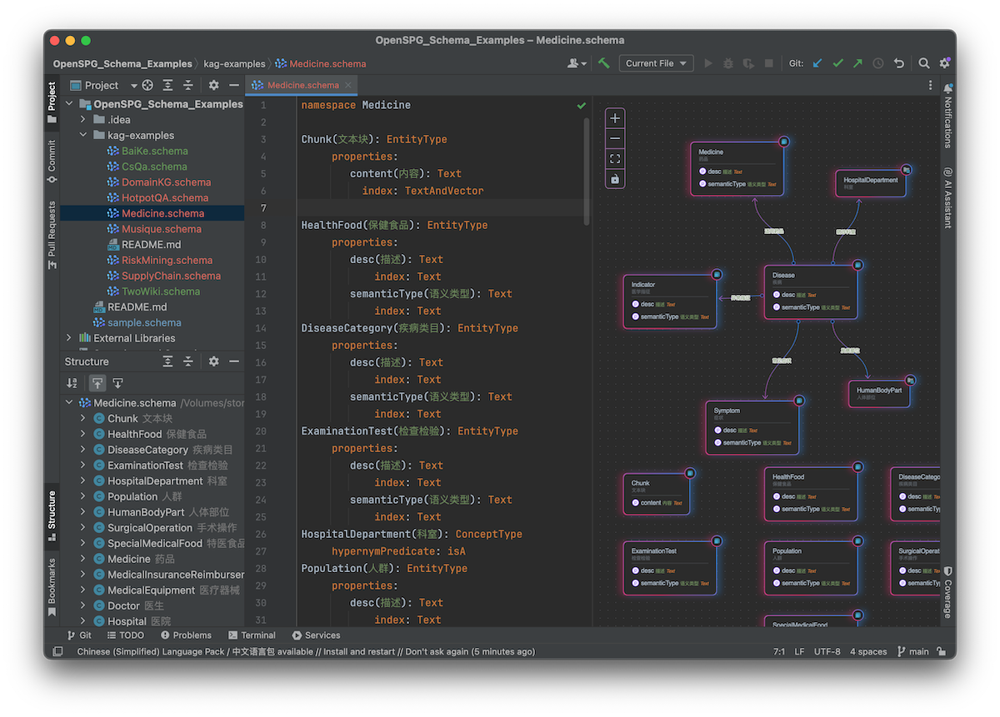

# OpenSPG Schema Idea Plugin

An IDEA plugin for OpenSPG Schema Mark Language

- [JETBRAINS Marketplace](https://plugins.jetbrains.com/plugin/26288-openspg-schema-mark-language-highlighter/)

## Preview

    

## Features:

- Code style settings
- Color setting page
- Commenter
- Completion
- Formatter
- Line marker
- Reference
- Syntax highlighter
- Structure view
- Preview
- Folding

## TODO

- Annotator
- Quick fix
- Spell checking
- Find usages
